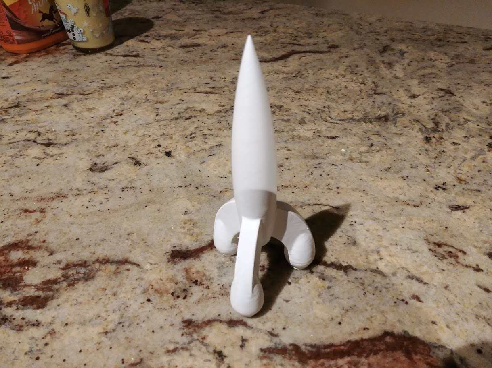
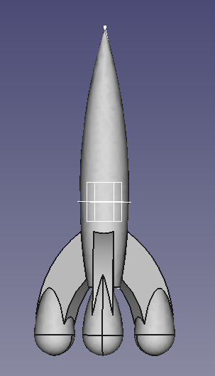

# Tintin_Rocket

I made this tintin rocket using Freecad. I'm not sure the dimension perfectly match with the original Tintin rocket (from Hergé cartoon).

You are free to use it. If you want to print it, you might need to rotate it (I messed with the axes...).

Here is the result :

